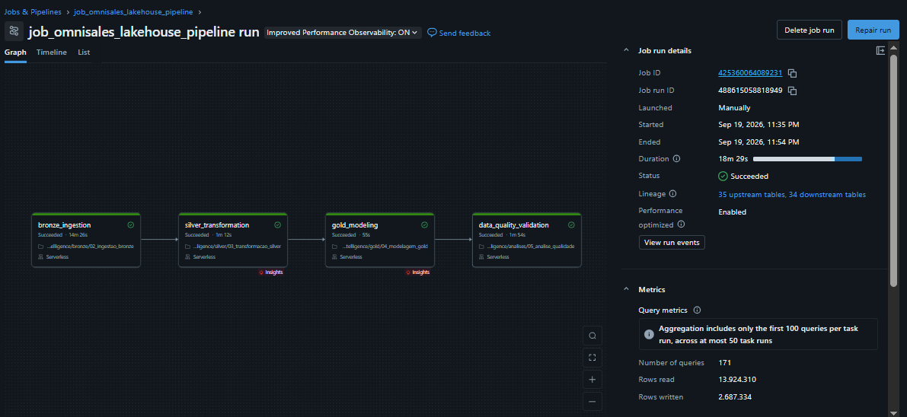

# 🛒 OmniSales Service Intelligence Lakehouse
MVP acadêmico de Engenharia de Dados | Databricks Free Edition | Olist

> Uma pipeline rastreável para analisar a jornada do pedido, das vendas à entrega e avaliação do cliente.

> MVP desenvolvido no módulo de Engenharia de Dados da pós-graduação em Ciência de Dados e Analytics da PUC-Rio (2026).

*CSV Olist → Setup: validação da landing zone → Bronze → Silver + quarentena → Gold → Qualidade → Análises de negócio*

## 🎯 Contexto
Em um marketplace, pedidos, itens, pagamentos, preços, fretes, sellers, localização, entregas e avaliações ficam distribuídos entre tabelas operacionais. Essa fragmentação dificulta relacionar faturamento e volume à confiabilidade logística e à satisfação. O MVP integra e qualifica esses dados em um Lakehouse para apoiar decisões comerciais e operacionais.

As cinco perguntas priorizadas foram mantidas na redação original do projeto:

- Quais categorias, sellers e estados concentram maior número de pedidos, receita de produtos, valor de frete e ticket médio?

- Qual é a taxa de entrega no prazo, o atraso médio e o prazo médio de entrega por seller, categoria e estado do cliente?

- Pedidos entregues após a data estimada apresentam avaliações piores do que pedidos entregues no prazo?

- Como a distância aproximada entre seller e cliente se relaciona com prazo de entrega, atraso e valor de frete?

- Quais sellers ou categorias combinam alta receita com baixa confiabilidade logística e baixa satisfação?

## 📦 Fonte e licenças
O projeto utiliza o Brazilian E-Commerce Public Dataset by Olist, na página original do Kaggle, uma base histórica e anonimizada de aproximadamente 100 mil pedidos realizados entre 2016 e 2018. Os dados não representam uma operação atual. O dataset está disponível em: https://www.kaggle.com/datasets/olistbr/brazilian-ecommerce.

A página da fonte informa a licença CC BY-NC-SA 4.0 para o dataset: atribuição, uso não comercial e compartilhamento de adaptações nos termos dessa licença. Os dados Olist não estão cobertos pela licença MIT atribuída ao código autoral deste repositório. Consulte DATA_LICENSE.md antes de redistribuir dados ou derivados. Os CSVs originais não são incluídos aqui; obtenha-os diretamente da fonte.

## 🧱 Pipeline e entregas
| Etapa	| O que faz |
| --- | --- |
| 01 · Setup |	O notebook 01-VALIDAÇÃO LANDING ZONE verifica a disponibilidade dos arquivos de entrada antes da ingestão. |
| 02 · Bronze	| Ingere os CSVs e registra dados de origem e metadados técnicos. |
| 03 · Silver	| Padroniza e valida os registros; isola dados inválidos em quarentena. |
| 04 · Gold |	Produz fatos no grão de pedido e item, dimensões e marts de consumo analítico. |
| 05 · Qualidade	| Verifica regras críticas de completude, domínio, unicidade, integridade e rastreabilidade; cinco dimensões terminaram com issue_count = 0 e status APROVADO. |
| 06 · Análise	| Responde às cinco perguntas com SQL, tabelas, gráficos e interpretação de negócio. |
| 07 · Governança	| Documenta os ativos e seus atributos, apoiando entendimento e rastreabilidade. |

O Job job_omnisales_lakehouse_pipeline encadeia ``Bronze → Silver → Gold → Qualidade``. As quatro tasks concluem uma execução manual ou agendada com sucesso. O notebook de setup não é task desse Job: ele deve ser executado antes, quando a landing zone for preparada ou validada. Os notebooks de análise e governança também não fazem parte desse grafo de quatro tasks. 



## 🗂️ Organização do repositório

## Organização do repositório

```text
omnisales-service-intelligence-lakehouse/
├── README.md
├── LICENSE
├── DATA_LICENSE.md
├── .gitignore
├── setup/
│   └── 01-VALIDAÇÃO LANDING ZONE
├── bronze/
│   └── 02_ingestao_bronze
├── silver/
│   └── 03_transformacao_silver
├── gold/
│   └── 04_modelagem_gold
├── analises/
│   └── 05_analise_qualidade
│   └── 06_analise_dados
├── governanca/
│   └── 07_governanca_catalogo                       
└── docs/                      
```

## 🚀 Reproduzir em outra conta do Databricks
1. Crie um workspace Databricks com permissões para ler arquivos e criar os objetos necessários. Baixe os CSVs diretamente da fonte Olist.

2. Faça download do repositório pelo GitHub (Code → Download ZIP) ou conecte-o ao Databricks por uma Git folder. Na opção ZIP, importe os notebooks para o Workspace; pela Git folder, conecte sua conta GitHub e crie a pasta vinculada ao repositório. 

3. Confirme que os arquivos foram reconhecidos como notebooks. Consulte a documentação de importação/exportação e de Git folders do Databricks.

4. Carregue os CSVs em uma landing zone acessível no novo workspace. Antes de executar, revise caminhos absolutos e seus nomes, catálogo/esquemas, nomes de volumes, permissões e configurações de compute. 

5. Execute setup/01-VALIDAÇÃO LANDING ZONE e confirme que ele encontra os arquivos esperados. Se a validação falhar, corrija caminhos e arquivos antes de seguir.

6. Execute, nessa ordem, os notebooks Bronze → Silver → Gold → analise_qualidade. Verifique as contagens e o resumo de qualidade. 

7. Depois execute analise_dados; utilize Governança conforme sua finalidade de catalogação/documentação dos datasets. Antes de reexecutar sobre tabelas existentes, revise o comportamento de substituição ou reprocessamento de cada notebook.

8. Se quiser reproduzir a orquestração, configure em Jobs & Pipelines → Create → Job quatro tasks do tipo Notebook. Faça Silver depender de Bronze, Gold depender de Silver e Qualidade depender de Gold, com execução após sucesso. Aponte as tasks para os caminhos do novo workspace; não copie caminhos pessoais do Job original. Deixe o agendamento desativado (se preferir, pode agendar) e teste manualmente depois de validar a landing zone.

## ✅ Resultado e limitações
O notebook analítico abordou as cinco perguntas priorizadas. Na comparação direta de satisfação, pedidos atrasados registraram avaliação média de 2,57 e 54,00% de avaliações baixas, frente a 4,39 e 3,16% nos entregues no prazo. 

A análise por categoria preserva o grão de item: prazo e dias de atraso existem no grão de pedido, e pedidos com múltiplas categorias exigem uma regra explícita de atribuição antes de calcular essas médias por categoria. A distância é aproximada e não representa uma rota real. A ingestão usa dados históricos e o Job foi executado sob demanda; atualização incremental, alertas e monitoramento contínuo ficam como evoluções futuras.

## 📄 Licenciamento
O código e a documentação autoral estão sob a licença MIT. Os dados originais da Olist seguem os termos indicados na página da fonte, descritos em DATA_LICENSE.md. A MIT não concede direitos sobre o dataset ou outros materiais de terceiros.

> A documentação completa, com o passo a passo de desenvolvimento e execução, está disponível em [Documentação do MVP OmniSales](docs/mvp_eng_dados_omnisales.pdf).